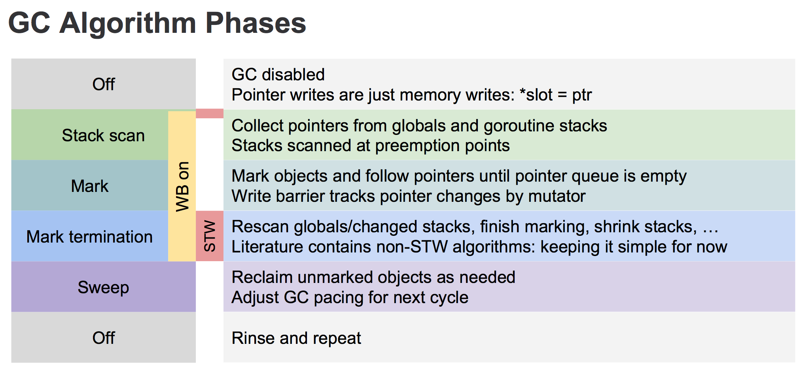

# Go的垃圾回收器
go语言垃圾回收总体采用的是经典的mark and sweep算法。  
* 1.3版本之前，golang的垃圾回收算法都非常简陋，然后其性能也被广为诟病：go runtime在一定条件下（内存超过阈值或定期如2min），暂停所有任务的执行，进行mark&sweep操作，操作完成后启动所有任务的执行。在内存使用较多的场景下，go程序在进行垃圾回收时会发生非常明显的卡顿现象（Stop The World）。在对响应速度要求较高的后台服务进程中，这种延迟简直是不能忍受的。当时解决这个问题比较常用的方法是尽快控制自动分配内存的内存数量，以减少gc负荷，同时采用手动管理内存的方法处理需要大量及高频分配内存的场景。
  
* 1.3版本开始go team开始对gc性能进行持续的改进和优化，1.3版本中，go runtime分离了mark和sweep操作，和以前一样，也是先暂停所有任务执行并启动mark，mark完成后马上就重新启动被暂停的任务，让sweep任务和普通协程任务一样并行地一起执行。如果运行在多核处理器上，go会试图将gc任务放到单独的核心上运行而尽量不影响业务代码的执行。go team自己的说法是减少了50%-70%的暂停时间。
  
* 1.4版本对gc的性能改动并不多。1.4版本中runtime很多代码取代了原生c语言实现而采用了go语言实现。对gc带来的一大改变是可以实现精确的gc。c语言实现在gc时无法获取到内存的对象信息，因此无法准确区分普通变量和指针，只能将普通变量当做指针，如果碰巧这个普通变量指向的空间有其他对象，那这个对象就不会被回收。而go语言实现是完全知道对象的类型信息，在标记时只会遍历指针指向的对象，这样就避免了c实现时的堆内存浪费（解决约10-30%）。
  
* 1.5版本go team对gc又进行了比较大的改进。官方的主要目标是减少延迟。go 1.5正在实现的垃圾回收器是“非分代的、非移动的、并发的、三色的标记清除垃圾回收器”。这种方法的mark操作时可以渐进执行的而不需要每次都扫描整个内存空间，可以减少stop the world的时间。

#常见的GC模式
* 引用计数（reference counting）

引用计数的思想非常简单：每个单元维护一个域，保存其他单元指向它的引用数量（类似有向图的入度）。当引用数量为0时，将其回收。引用计数是渐进式的，能够将内存管理的开销分布到整个程序之中。C++的share_ptr使用的就是引用计数方法（php、python使用）。

引用计数算法实现一般是把所有的单元放在一个单元池里，比如类似free list。这样所有的单元就被串起来了，就可以进行引用计数了。新分配的单元数值被设置为1（注意不是0，因为申请一般都说ptr = new object这种）。每次有一个指针被设为指向该单元时，该单元的计数值加1；而每次删除某个指向它的指针时，它的计数值减1.当其引用计数为0的时候，该单元就会被回收。
  
优点
1. 渐进式。内存管理与用户程序的执行交织在一起，将GC的代价分散到整个程序。不像标记-清扫算法需要STW（Stop The World，GC的时候挂起用户程序）
2. 算法易于实现。
3. 内存单元能够很快被回收。相比于其他垃圾回收算法，堆被耗尽或者达到某个阈值才会进行垃圾回收。

缺点
1. 原始的引用计数不能处理循环引用。大概这是被诟病最多的缺点了。不过针对这个问题，也提出了很多解决方案，比如强引用等。
2. 维护引用计数降低运行效率。内存单元的更新删除等都需要维护相关的内存单元的引用计数，相比于一些追踪式的垃圾回收算法并不需要这些代价。
3. 单元池free list实现的话不是cache-friendly的，这样会导致频繁的cache miss，降低程序运行效率。

* 标记清除（mark and sweep）

标记-清扫算法是第一种自动内存管理，基于追踪的垃圾收集算法。算法思想在70年代就提出了，是一种非常古老的算法。内存单元并不会在变成垃圾时立刻被回收，而是保持不可达状态，直到到达某个阈值或者固定时间长度。这个时候系统会挂起用户程序，也就是STW，转而执行垃圾回收程序。垃圾回收程序对所有的存活单元进行一次全局遍历来确定哪些单元可以回收。算法分两个部分：标记（mark）和清扫（sweep）。标记阶段标明所有的存活单元，清扫阶段将垃圾单元回收。可视化可以参考下图：  
  
标记-清扫算法的优点也就是基于追踪的垃圾回收算法具有的优点：避免了引用计数算法的缺点（不能处理循环引用，需要维护指针）。缺点也很明显，需要STW。

* 三色标记算法

三色标记算法是对标记阶段的改进，原理如下：
1. 起初所有对象都是白色。
2. 从根出发扫描所有可达对象，标记为灰色，放入待处理队列。
3. 从队列取出灰色对象，将其引用对象标记为灰色放入队列，自身标记为黑色。
4. 重复3，知道灰色对象队列为空。此时白色对象即为垃圾，进行回收。  

  
三色标记的一个明显好处是能够让用户程序和mark并发地进行。


* 分代搜集（generation）jvm使用分代回收的思路。在面向对象编程的语言中，绝大多数对象的生命周期都非常短。分代收集的基本思想是，将堆划分为两个或多个称为代（generation）的空间。新创建的对象存放在被称为新生代（young generation）中（一般来说，新生代的大小会比老年代小很多），随着垃圾回收的重复执行，生命周期较长的对象会被提升（promotion）到老年代中。因此，新生代垃圾回收和老年代垃圾回收两种不同的垃圾回收方式应运而生，分别用于对各自空间中的对象执行垃圾回收。新生代垃圾回收的速度非常快，比老年代快几个数量级，即使新生代垃圾回收的频率更高，执行频率也依然比老年代垃圾回收强，这是因为大多数对象的生命周期都很短，根本无需提升到老年代。

# Golang中的gc通常是如何工作的
golang中的gc基本上是标记清除的思路：

在堆内存中存储着一系列的对象，这些对象可能会与其他对象有关联。GC会在某一个时间点上停止原本正在运行的程序，之后它会扫描runtime已知的所有对象集合，通常它们是存在于stack中的全局变量及各种对象。gc会对这些对象进行标记，将这些对象的状态标记为可达，从中找出所有的，从当前的这些对象可以达到的其他地方的对象的reference，并且将这些对象也标记为可达对象，这个步骤被称为mark phase，即标记阶段，这一步的主要目的是用于获取这些对象的状态信息。

一旦将所有的这些对象都扫描完，gc就会获取到所有的无法reach的对象（状态为unreachable），并且将它们回收，这一步称为sweep phase，即清扫阶段。

gc仅仅搜集那些未被标记为可达（reachable）的对象。如果gc没有识别出一个reference，最后有可能会将一个仍然在使用的对象回收掉，就引起了程序运行错误。

可以看到主要的三个步骤：扫描，回收，清扫

# GC中的问题
最大的问题是：对于reference的识别比较难，machine code很难知道，怎样才算是一个reference。如果漏掉了一个reference，就会使得原本没有准备好要被free掉的内存，现在被错误地free掉，所以策略就是宁多勿少。

一种策略就是把所有的memory空间都看做是有可能的reference（指针值）。这种被称为保守型垃圾回收器。就是说把内存中的普通变量也当做指针一样去处理，尽量cover到所有指针的情况。如果碰巧这个普通的变量值所指向的空间有其他的对象，那么这个对象是不会被回收的。而go语言实现是完全知道对象的类型信息，在标记时只会遍历指针指向的对象，这样就避免了c实现时的堆内存浪费（解决约10-30%）。

# 如何测量GC
golang中的gc是使用标记-清除法，所以gc的总时间为
Tgc = Tseq + Tmark + Tsweep（T表示time）
* Tseq表示是停止用户的goroutine和做一些准备活动（通常很小）需要的时间
* Tmark是堆标记时间，标记发生在所有用户goroutine停止时，因此可以显著地影响处理的延迟
* Tsweep是堆清除时间，清除通常与正常的程序运行同时发生，所以对延迟来说是不太关键的。

# Golang GC
1. 何时触发GC

在堆上分配大于32K byte对象的时候进行检测此时是否满足垃圾回收条件，如果满足，则进行垃圾回收。
``` go
 func mallocgc(size uintptr, typ *_type, needzero bool) unsafe.Pointer {
      ...
      shouldhelpgc := false
      // 分配的对象小于 32K byte
      if size <= maxSmallSize {
          ...
      } else {
          shouldhelpgc = true
          ...
     }
     ...
     // gcShouldStart() 函数进行触发条件检测
     if shouldhelpgc && gcShouldStart(false) {
         // gcStart() 函数进行垃圾回收
         gcStart(gcBackgroundMode, false)
     }
 }
```   
上面是自动垃圾回收，还有一种是主动垃圾回收，通过调用runtime.GC()，这是阻塞式的。
``` go
// GC runs a garbage collection and blocks the caller until the
 // garbage collection is complete. It may also block the entire
 // program.
  func GC() {
     gcStart(gcForceBlockMode, false)
 }
```  
2. GC触发条件  

触发条件主要关注下面代码的中间部分：forceTrigger || memstats.heap_live >= memstats.gc_trigger 。forceTrigger是forceGC的标志：后面半句的意思是当前堆上的活跃对象大于我们初始化时候设置的GC触发阈值。在malloc以及free的时候heap_live会一直进行更新。  
```go
// gcShouldStart returns true if the exit condition for the _GCoff
  // phase has been met. The exit condition should be tested when
  // allocating.
  //
  // If forceTrigger is true, it ignores the current heap size, but
  // checks all other conditions. In general this should be false.
  func gcShouldStart(forceTrigger bool) bool {
      return gcphase == _GCoff && (forceTrigger || memstats.heap_live >= memstats.gc_trigger) && memstats.enablegc && panicking == 0 && gcpercent >= 0
  }
 
 //初始化的时候设置 GC 的触发阈值
 func gcinit() {
     _ = setGCPercent(readgogc())
     memstats.gc_trigger = heapminimum
     ...
 }
 // 启动的时候通过 GOGC 传递百分比 x
 // 触发阈值等于 x * defaultHeapMinimum (defaultHeapMinimum 默认是 4M)
 func readgogc() int32 {
     p := gogetenv("GOGC")
     if p == "off" {
         return -1
     }
     if n, ok := atoi32(p); ok {
         return n
     }
     return 100
 }
```  
3. 垃圾回收的主要流程：  
三色标记法，主要流程如下：
* 所有对象最开始都是白色。
* 从root开始找到所有可达对象，标记为灰色，放入待处理队列。
* 遍历灰色对象队列，将其引用对象标记为灰色放入待处理队列，自身标记为黑色。
* 处理完灰色对象队列，执行清扫工作。  
  
关于上图有几点需要说明的是：
* 首先从root开始遍历，root包括全局指针和goroutine栈上的指针。
* mark有两个过程  
    1） 从root开始遍历，标记为灰色。遍历灰色队列。  
    2） re-scan全局指针和栈。因为mark和用户程序是并行的，所以在过程1的时候可能会有新的对象分配，这个时候就需要通过写屏障（write barrier）记录下来。re-scan再完成检查一下。
* Stop The World有两个过程
    1） 第一个是GC将要开始的时候，这个时候主要是一些准备工作，比如enable write barrier。  
    2） 第二个过程就是上面提到的re-scan过程。如果这个时候没有stw，那么mark将无休止。  

另外针对上图各个阶段，对应GCPhase如下：
* Off:_GCoff
* Stack scan ~ Mark:_GCmark
* Mark termination:_GCmarktermination

##写屏障（write barrier）
垃圾回收中的写屏障可以理解为编译器在写操作时特意插入的一段代码，对应的还有read barrier。  
为什么需要写屏障，很简单，对于和用户程序并发运行的垃圾回收算法，用户程序会一直修改内存，所以要记录下来。  
Golang 1.7之前的write barrier使用经典的 Dijkstra-style insertion write barrier [Dijkstra ‘78]，STW的主要耗时就在stack re-scan的过程。自1.8之后采用一种混合的write barrier方式（Yuasa-style deletion write barrier [Yuasa ‘90] 和 Dijkstra-style insertion write barrier [Dijkstra ‘78]）来避免re-scan。   
## 标记
下面的源码还是基于go1.8rc3。这个版本的GC代码相比之前改动还是挺大的，我们下面尽量只关注主流程。垃圾回收的代码主要集中在函数GCStart()中。
```go
// gcStart 是 GC 的入口函数，根据 gcMode 做处理。
 // 1. gcMode == gcBackgroundMode（后台运行，也就是并行）, _GCoff -> _GCmark
 // 2. 否则 GCoff -> _GCmarktermination，这个时候就是主动 GC 
 func gcStart(mode gcMode, forceTrigger bool) {
     ...
 }
```  
1. STW phase1

在GC开始之前的准备工作。
```go
func gcStart(mode gcMode, forceTrigger bool) {
      ...
      //在后台启动 mark worker 
      if mode == gcBackgroundMode {
          gcBgMarkStartWorkers()
      }
      ...
      // Stop The World
      systemstack(stopTheWorldWithSema)
     ...
     if mode == gcBackgroundMode {
         // GC 开始前的准备工作
 
         //处理设置 GCPhase，setGCPhase 还会 enable write barrier
         setGCPhase(_GCmark)
           
         gcBgMarkPrepare() // Must happen before assist enable.
         gcMarkRootPrepare()
 
         // Mark all active tinyalloc blocks. Since we're
         // allocating from these, they need to be black like
         // other allocations. The alternative is to blacken
         // the tiny block on every allocation from it, which
         // would slow down the tiny allocator.
         gcMarkTinyAllocs()
           
         // Start The World
         systemstack(startTheWorldWithSema)
     } else {
         ...
     }
 }
```  
2. Mark  

Mark阶段是并行的运行，通过在后台一直运行mark worker来实现。
```go
func gcStart(mode gcMode, forceTrigger bool) {
      ...
      //在后台启动 mark worker 
      if mode == gcBackgroundMode {
          gcBgMarkStartWorkers()
      }
  }
  
  func gcBgMarkStartWorkers() {
     // Background marking is performed by per-P G's. Ensure that
     // each P has a background GC G.
     for _, p := range &allp {
         if p == nil || p.status == _Pdead {
             break
         }
         if p.gcBgMarkWorker == 0 {
             go gcBgMarkWorker(p)
             notetsleepg(&work.bgMarkReady, -1)
             noteclear(&work.bgMarkReady)
         }
     }
 }
 // gcBgMarkWorker 是一直在后台运行的，大部分时候是休眠状态，通过 gcController 来调度
 func gcBgMarkWorker(_p_ *p) {
     for {
         // 将当前 goroutine 休眠，直到满足某些条件
         gopark(...)
         ...
         // mark 过程
         systemstack(func() {
         // Mark our goroutine preemptible so its stack
         // can be scanned. This lets two mark workers
         // scan each other (otherwise, they would
         // deadlock). We must not modify anything on
         // the G stack. However, stack shrinking is
         // disabled for mark workers, so it is safe to
         // read from the G stack.
         casgstatus(gp, _Grunning, _Gwaiting)
         switch _p_.gcMarkWorkerMode {
         default:
             throw("gcBgMarkWorker: unexpected gcMarkWorkerMode")
         case gcMarkWorkerDedicatedMode:
             gcDrain(&_p_.gcw, gcDrainNoBlock|gcDrainFlushBgCredit)
         case gcMarkWorkerFractionalMode:
             gcDrain(&_p_.gcw, gcDrainUntilPreempt|gcDrainFlushBgCredit)
         case gcMarkWorkerIdleMode:
             gcDrain(&_p_.gcw, gcDrainIdle|gcDrainUntilPreempt|gcDrainFlushBgCredit)
         }
         casgstatus(gp, _Gwaiting, _Grunning)
         })
         ...
     }
 }
```  
Mark阶段的标记代码主要在函数gcDrain()中实现。
```go
// gcDrain scans roots and objects in work buffers, blackening grey
  // objects until all roots and work buffers have been drained.
  func gcDrain(gcw *gcWork, flags gcDrainFlags) {
      ...    
      // Drain root marking jobs.
      if work.markrootNext < work.markrootJobs {
          for !(preemptible && gp.preempt) {
              job := atomic.Xadd(&work.markrootNext, +1) - 1
              if job >= work.markrootJobs {
                 break
             }
             markroot(gcw, job)
             if idle && pollWork() {
                 goto done
             }
         }
     }
       
     // 处理 heap 标记
     // Drain heap marking jobs.
     for !(preemptible && gp.preempt) {
         ...
         //从灰色列队中取出对象
         var b uintptr
         if blocking {
             b = gcw.get()
         } else {
             b = gcw.tryGetFast()
             if b == 0 {
                 b = gcw.tryGet()
             }
         }
         if b == 0 {
             // work barrier reached or tryGet failed.
             break
         }
         //扫描灰色对象的引用对象，标记为灰色，入灰色队列
         scanobject(b, gcw)
     }
 }
```  
3. Mark termination（STW phase 2）

mark termination阶段会stop the world。函数实现在gcMarkTermination()。1.8版本已经不会再对goroutine stack进行re-scan了。
```go
func gcMarkTermination() {
      // World is stopped.
      // Run gc on the g0 stack. We do this so that the g stack
      // we're currently running on will no longer change. Cuts
      // the root set down a bit (g0 stacks are not scanned, and
      // we don't need to scan gc's internal state).  We also
      // need to switch to g0 so we can shrink the stack.
      systemstack(func() {
          gcMark(startTime)
         // Must return immediately.
         // The outer function's stack may have moved
         // during gcMark (it shrinks stacks, including the
         // outer function's stack), so we must not refer
         // to any of its variables. Return back to the
         // non-system stack to pick up the new addresses
         // before continuing.
     })
     ...
 }
```
## 清扫
清扫相对来说就简单很多了。
```go
func gcSweep(mode gcMode) {
    ...
    //阻塞式
    if !_ConcurrentSweep || mode == gcForceBlockMode {
        // Special case synchronous sweep.
        ...
        // Sweep all spans eagerly.
        for sweepone() != ^uintptr(0) {
            sweep.npausesweep++
        }
        // Do an additional mProf_GC, because all 'free' events are now real as well.
        mProf_GC()
        mProf_GC()
        return
    }
      
    // 并行式
    // Background sweep.
    lock(&sweep.lock)
    if sweep.parked {
        sweep.parked = false
        ready(sweep.g, 0, true)
    }
    unlock(&sweep.lock)
}
```  
对于并行式清扫，在GC初始化的时候就会启动bgsweep()，然后在后台一直循环。
```go
func bgsweep(c chan int) {
    sweep.g = getg()

    lock(&sweep.lock)
    sweep.parked = true
    c <- 1
    goparkunlock(&sweep.lock, "GC sweep wait", traceEvGoBlock, 1)

    for {
        for gosweepone() != ^uintptr(0) {
            sweep.nbgsweep++
            Gosched()
        }
        lock(&sweep.lock)
        if !gosweepdone() {
            // This can happen if a GC runs between
            // gosweepone returning ^0 above
            // and the lock being acquired.
            unlock(&sweep.lock)
            continue
        }
        sweep.parked = true
        goparkunlock(&sweep.lock, "GC sweep wait", traceEvGoBlock, 1)
    }
}

func gosweepone() uintptr {
    var ret uintptr
    systemstack(func() {
        ret = sweepone()
    })
    return ret
}
```  
不管是阻塞式还是并行式，都是通过sweepone()函数来做清扫工作的。内存管理都是基于span的，mheap_是一个全局的变量，所有分配的对象都会记录在mheap_中。在标记的时候，我们只要找到对象对应的span进行标记，清扫的时候扫描span，没有标记的span就可以回收了。
```go
// sweeps one span
// returns number of pages returned to heap, or ^uintptr(0) if there is nothing to sweep
func sweepone() uintptr {
    ...
    for {
        s := mheap_.sweepSpans[1-sg/2%2].pop()
        ...
        if !s.sweep(false) {
            // Span is still in-use, so this returned no
            // pages to the heap and the span needs to
            // move to the swept in-use list.
            npages = 0
        }
    }
}

// Sweep frees or collects finalizers for blocks not marked in the mark phase.
// It clears the mark bits in preparation for the next GC round.
// Returns true if the span was returned to heap.
// If preserve=true, don't return it to heap nor relink in MCentral lists;
// caller takes care of it.
func (s *mspan) sweep(preserve bool) bool {
    ...
}
```  
## 其他
1. gcWork

这里介绍一下任务队列，或者说灰色对象管理。每个P上都有一个gcw用来管理灰色对象（get和put），gcw的结构就是gcWork。gcWork中的核心是wbuf1和wbuf2，里面存储的就是灰色对象，或者说是work（下面就全部统一叫做work）。
```go
type p struct {
    ...
    gcw gcWork
}

type gcWork struct {
    // wbuf1 and wbuf2 are the primary and secondary work buffers.
    wbuf1, wbuf2 wbufptr
  
    // Bytes marked (blackened) on this gcWork. This is aggregated
    // into work.bytesMarked by dispose.
    bytesMarked uint64

    // Scan work performed on this gcWork. This is aggregated into
    // gcController by dispose and may also be flushed by callers.
    scanWork int64
}
```  
既然每个P上有一个work buffer，那么是不是还有一个全局的work list呢？是的，通过在每个P上绑定一个work buffer的好处和cache一样，不需要加锁。
```go
var work struct {
    full  uint64                   // lock-free list of full blocks workbuf
    empty uint64                   // lock-free list of empty blocks workbuf
    pad0  [sys.CacheLineSize]uint8 // prevents false-sharing between full/empty and nproc/nwait
    ...
}
```  
那么为什么使用两个work buffer（wbuf1和wbuf2）呢？下面举个例子。比如现在要get一个work出来，先从wbuf1中取，wbuf1为空的话就和wbuf2 swap再get。在其他时间将work buffer中的full或者empty buffer移到global的work中。这样的好处在于，在get的时候去全局的work里面取（多个goroutine去取会有竞争）。这里有趣的是global的work list是lock-free的，通过原子操作cas等实现。下面列举几个函数看一下gcWork。  
初始化
```go
func (w *gcWork) init() {
    w.wbuf1 = wbufptrOf(getempty())
    wbuf2 := trygetfull()
    if wbuf2 == nil {
        wbuf2 = getempty()
    }
    w.wbuf2 = wbufptrOf(wbuf2)
}
```  
put
```go
// put enqueues a pointer for the garbage collector to trace.
// obj must point to the beginning of a heap object or an oblet.
func (w *gcWork) put(obj uintptr) {
    wbuf := w.wbuf1.ptr()
    if wbuf == nil {
        w.init()
        wbuf = w.wbuf1.ptr()
        // wbuf is empty at this point.
    } else if wbuf.nobj == len(wbuf.obj) {
        w.wbuf1, w.wbuf2 = w.wbuf2, w.wbuf1
        wbuf = w.wbuf1.ptr()
        if wbuf.nobj == len(wbuf.obj) {
            putfull(wbuf)
            wbuf = getempty()
            w.wbuf1 = wbufptrOf(wbuf)
            flushed = true
        }
    }

    wbuf.obj[wbuf.nobj] = obj
    wbuf.nobj++
}
```  
get
```go
// get dequeues a pointer for the garbage collector to trace, blocking
// if necessary to ensure all pointers from all queues and caches have
// been retrieved.  get returns 0 if there are no pointers remaining.
//go:nowritebarrier
func (w *gcWork) get() uintptr {
    wbuf := w.wbuf1.ptr()
    if wbuf == nil {
        w.init()
        wbuf = w.wbuf1.ptr()
        // wbuf is empty at this point.
    }
    if wbuf.nobj == 0 {
        w.wbuf1, w.wbuf2 = w.wbuf2, w.wbuf1
        wbuf = w.wbuf1.ptr()
        if wbuf.nobj == 0 {
            owbuf := wbuf
            wbuf = getfull()
            if wbuf == nil {
                return 0
            }
            putempty(owbuf)
            w.wbuf1 = wbufptrOf(wbuf)
        }
    }

    // TODO: This might be a good place to add prefetch code

    wbuf.nobj--
    return wbuf.obj[wbuf.nobj]
}
```  
2. forcegc
GC有两种触发方式：自动检测和用户主动调用。除此之外，Golang本身还会对运行状态进行监控，如果超过两分钟没有GC，则触发GC。监控函数是sysmon()，在主goroutine中启动。
```go
// The main goroutine
func main() {
    ...
    systemstack(func() {
          newm(sysmon, nil)
    })
}
// Always runs without a P, so write barriers are not allowed.
func sysmon() {
    ...
    for {
        now := nanotime()
        unixnow := unixnanotime()
          
        lastgc := int64(atomic.Load64(&memstats.last_gc))
        if gcphase == _GCoff && lastgc != 0 && unixnow-lastgc > forcegcperiod && atomic.Load(&forcegc.idle) != 0 {
            lock(&forcegc.lock)
            forcegc.idle = 0
            forcegc.g.schedlink = 0
            injectglist(forcegc.g)    // 将 forcegc goroutine 加入 runnable queue
            unlock(&forcegc.lock)
        }
    }
}

var forcegcperiod int64 = 2 * 60 *1e9    //两分钟
```
